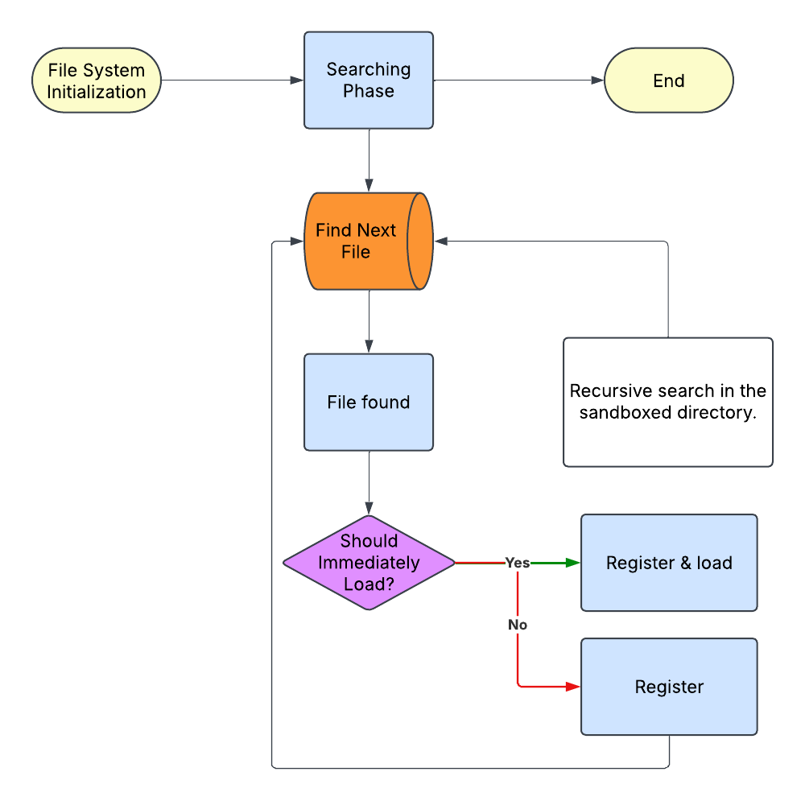

[TOC]
## What is Atlas {#what-is-Atlas}

---

Atlas is the response to the lack of a free game engine that is built for large open worlds. While Unity or Unreal can make open world games, there are alot of hoops that must be jumped through first, which is why there is a need for it.  Atlas aims to be flexible and moldable to suit needs without having to make major changes. It also aims to be easy to work with and a limited number of complex components. 

If you are looking for a hello world application, please see \ref hello-world-example

## Architecture {#architecture}

---

The architecture of Atlas can get complex at some points, but the documentation is extensive to make up for this and reduce the learning curve.

### Flow {#flow-architecture}
---

Due to the inherent nature of Atlas, the architecture can be complex. In terms of building, there are a few things that are required to understand how Atlas works. There are 4 groups that are used to build the engine, as outlined below:
- Application
- Engine
- Project
- Tools
The Application is responsible for loading the engine and handling the project, as seen below. 


#### Using Projects {#using-projects}

---

Atlas interacts with your game through the IProject class. More specifically, it interacts through the derived class. Within `project.h` in the `project_lib` project, you will see this at the top of the file:

```
#ifndef ATLAS_BUILD_EXAMPLES
	#define PROJECT_TYPENAME Project
#else
	...
#endif
```

Now what does this mean? This is how Atlas knows what your derivative class is. If you are using the already provided class, then this does not have to be worried about. However, this is used when you need to have a lower-level control of the engine. Atlas interacts through the various virtual functions that are found within \ref IProject in \ref Project.h. If you have questions about these events, please refer to \ref IProject.

### File System Architecture {#file-system-architecture}

---

>**The design of the file system will cause errors if it is used improperly. As a result, it is highly encouraged that this is read very carefully. **

As of now, the file system works by recursively searching the "game" folder in the root directory (Techstorm-v5). The folder will contain the "assets" and "data" sub-directories, wherein you will put assets and data files.  Any file that is within the search area will be registered. Another piece of important information is that the **filesystem is sandboxed**. As of version 0.0.3, the only directory that is accessible is the *game* directory within the root directory. This is a safety feature that protects against malicious mods. Furthermore, this reduces the need to have long strings that lead to a specific path. 

Atlas provides **three** methods of searching: by full path, sandboxed path, extension (highly discouraged because it does not account for duplicates), and filename. Sandboxed searching is the most recommended because it will only return those that are within the \c game directory. It is also much safer in general because it is contained to a single root folder that does not give mods the ability to mess with the user's operating system or the game itself (besides modifying config and assets). 
#### File Loading {#file-loading}

---

When it comes to files, there are two types of files: registered and loaded. During the searching phase, all files found become registered (unless their extension is marked to be immediately loaded). When the file is used for the first time, it immediately becomes loaded. A visual representation of the file loading step is below:



There are two ways to load a file:
	1. Call `GetFile("\\example\\path");`
	2. Call `LoadFile("\\example\\path);"`

However, just calling `GetFile()` is perfectly fine in itself. 

>Notice how "\\" was used in the path, **this must** be used as the directory divider 
##### Immediate File Loading {#immediate-file-loading}

---

Next, the topic of immediate loading needs to be discussed. Immediate loading is when the file system loads a file on registration if the extension is marked as such. In order to mark an extension to be immediately loaded, it must be done **PRIOR TO THE SEARCHING PHASE**. This is done within the **pre-initialization step**. Below is an example of this in action:

```
...


// project.h in the project_lib project
class Project final : public Atlas::IProject {
public:
	void preInit() override {
		IProject::preInit(); // this should always be here!
		
		using namespace std;
		
		// the first parameter is the extension that should be immediately loaded
		AddFileRegistryLoadFunction("txt", [](std::shared_ptr<FileMeta> fileMeta) {
			// any casting is important here!
			return std::any_cast<string>(LoadFileText(fileMeta->path.c_str()));
		});
	}
	
	...
};

```

As can be seen, the `AddFileRegistryLoadFunction()` is being called, with the extension and the corresponding loading function being passed. The file system is Laissez-faire in that it requires you to bring your own function to load extensions. Keep in mind that the any casting must be done here because RegisteredFile uses an std::any as a container for the data. Other than that, Atlas handles the rest.

When it comes to file loading, the **extension matters**. This is because the \ref FileSystemRegistry loads files based on the loading function assigned to the extension. For this reason, when getting the file, you must have the filename along with the extension, just the extension (highly discouraged, see \ref why-not-extensions), the exact path, and the sandboxed path. For this example, \c ExampleFile.txt will be used to represent a file. In order to get a file, please see below:
 
```
std::shared_ptr<RegisteredFile> file = GetFileSystemRegistry().getFile("ExampleFile.txt");
```


#### Extension loading {#extension-loading}

---

As of v0.0.7, Atlas has 

### Graphics Architecture {#graphics-architecture}

---

#### Graphics Introduction {#graphics-introduction}

---

Despite the fact Techstorm tries to make graphics easier, it can become complex due to the nature of 3D graphics. For this reason, it is imperative that you read this carefully in order to reduce future headache. In addition, if you are not well versed in how OpenGL and Raylib works, please read the online book/tutorial [Learn OpenGL](https://learnopengl.com/) and \ref using-raylib respectably.  

First, the mechanics of how Atlas handles rendering must be discussed. Atlas is a modular engine, which means that there are many individual classes that can be overridden to modify the engine. For a list of these, please see \ref atlas-modules. The `rendering` and `game object` system is heavy in this respect because there is alot of moving parts. A `renderer` in atlas can be also thought as a backend. By default, the provided renderer is built off of raylib. If you would like to implement your own rendering backend, please do so by overriding the /ref IRenderer class.

#### Using Models {#using-models}

---

Atlas makes models easy because it will automatically handle materials for it. 
### Modding Architecture {#modding-architecture}

---

Since Atlas comes with modding capability out of the box, there is less that has to be worried about. However, it is up to you to ensure that it is used properly. As of version 0.0.7, AngelScript is NOT yet implemented and there is no functionality for it yet. 
## Dependencies {#dependencies}

---

As it is a game engine, Atlas has alot of dependencies and can be found within the conanfile.txt in the same folder as the main CMakeLists.txt file. In addition to this, the current dependencies are listed as listed below with it's basic purpose. 

* Jolt Physics
	* Handle Techstorm's physics. 
	* [Online Documentation](https://jrouwe.github.io/JoltPhysics/index.html)
	* [Github](https://github.com/jrouwe/JoltPhysics/tree/master)
* Libconfig
	* Handle configuration file read/write.
	* [Online Documentation](http://hyperrealm.github.io/libconfig/libconfig_manual.html)
	* [Github](https://github.com/hyperrealm/libconfig)
	* [Website](http://hyperrealm.github.io/libconfig/)
* RmlUi
	* Handle Techstorm's UI with HTML/CSS.
	* [Online Documentation](https://mikke89.github.io/RmlUiDoc/)
	* [Github](https://github.com/mikke89/RmlUi)
* Asio
	* Provides Techstorm's networking functionality
	* [Online Documentation](https://think-async.com/Asio/asio-1.30.2/doc/)
	* [Website](https://think-async.com/Asio/)
* Argh
	* Command line parsing library that is mainly used by tools. 
	* [Online Documentation](https://github.com/adishavit/argh/blob/master/README.md)
	* [Github](https://github.com/adishavit/argh)
* Dear ImGUI
	* Provides an in-game debug UI for developers.
	* [Online Documentation](https://github.com/ocornut/imgui/wiki)
	* [Github](https://github.com/ocornut/imgui)
* Sol2
	* Provides Lua scripting and modding support.
	* [Online Documentation](https://sol2.readthedocs.io/en/latest/)
	* [Github](https://github.com/ThePhD/sol2)
* Angel Script
	* Provides a more advanced form of modding and scripting support.
	* [Online Documentation](https://www.angelcode.com/angelscript/documentation.html)
	* [Website](https://www.angelcode.com/angelscript/)

If you want an indepth explanation of these dependencies and their implementation status, see \ref detailed-analysis-of-dependencies. 

## Design Choices {#design-choices}

---

This section serves as an insight into why things are the way they are. Usually, documentation just describes the whats, wheres, and whos, but Atlas is extensively documented! This section will try to be as clear and thorough as possible in explaining the logic behind the design. The hope is that if you know the thinking, then you are able to know how it works and how to exploit it. 

## Code Conventions {#code-conventions}

---

Techstorm tries to be as easy to read as possible by making the code read similarly to English (This is mandatory for engine contributions!). In addition, Techstorm tries to be intuitive and understandable at a quick glance, hence it uses PascalCase and CamelCase. As such, the code conventions are simple and intuitive. The only exception is with broad cases. 

Broad cases should only be used as long as there are no other applicable cases. For example, a private static variable. This variable would look like a static type variable rather than a private variable, meaning it should be named with a prefix of "s" rather than a 'm'. However, please note that this only applies when the "Notes" section contains "Broad case". Additionally, There are some other important distinctions, definitions, and use cases that must be followed to stay compliant, as seen below.

### Important Convention Use Cases {#important-convention-use-cases}

---


| Case                                                                                                                                             | Distinction |
| ------------------------------------------------------------------------------------------------------------------------------------------------ | ----------- |
| Preprocessors, Unless there are multiple logical inputs, avoid using `#if defined()` and use `#ifdef` instead.                                   |             |
| Templates will be full caps, snake case with `T_` as it's prefix to make it distinct from Constant Expressions and Constant Globals, Macros, etc | `T_*`       |
|                                                                                                                                                  |             |


### Variables {#variables}

---

| Case                  | Format                       | Example                                            | Notes                                                               |
| --------------------- | ---------------------------- | -------------------------------------------------- | ------------------------------------------------------------------- |
| Private Variables     | mPrivateVariable             | `int mPrivateVariable = 7;`                        |                                                                     |
| Protected Variables   | mProtectedVariable           | `int mProtectedVariable = 4;`                      |                                                                     |
| Static Type Variables | sStaticTypeVariable          | `static inline float sStaticVariable = 3.14f;`     |                                                                     |
| Static Variable       | StaticVariable               | `static inline int StaticVariable = 72;`           |                                                                     |
| Constant Variable     | cConstantVariable            | `const double cConstantVariable = 3.14;`           |                                                                     |
| Constant Expression   | CONSTANT_EXPRESSION_VARIABLE | `constexpr int CONSTANT_EXPRESSION_VARIABLE = 45;` |                                                                     |
| Constant Global       | CONSTANT_GLOBAL_VARIABLE     | `const int GLOBAL_VARIABLE;`                       | A constant global is a variable that is not declared inside a type. |
| Macro                 | MACRO_VARIABLE               | `#define MACRO_VARIABLE 8`                         |                                                                     |
| Local Variable        | localVariable                | `int localVariable = 34;`                          |                                                                     |
| Parameter Variable    | parameterVariable            | `int parameterVariable`                            |                                                                     |
| Public Variable       | publicVariable               | `int publicVariable = 3;`                          |                                                                     |


### Functions {#functions}

---

Functions are simple, any that are not bound to a specific object will have the first letter lowercase. If it is a static, namespace, or global function, then it will have the first letter capitalized instead. The below chart shows how functions are named and used:

| Case                             | Format                               | Example                                                                                                      | Notes                                         |
| -------------------------------- | ------------------------------------ | ------------------------------------------------------------------------------------------------------------ | --------------------------------------------- |
| Macro                            | ATLAS_MACRO_FUNCTION(macroParameter) | ```<br>#ifndef ATLAS_MACRO_FUNCTION<br><br>#define ATLAS_MACRO_FUNCTION(macroVariable) <br><br>#endif<br>``` | The function is prefixed with ATLAS_          |
| Static Functions                 |                                      |                                                                                                              | Same rules apply for classes                  |
| Static Inline Functions          | ^                                    |                                                                                                              | ^                                             |
| Namespace functions              | ^                                    |                                                                                                              |                                               |
| Global Functions                 | ^                                    |                                                                                                              |                                               |
| Class Public Member Functions    |                                      |                                                                                                              |                                               |
| Class Private Member Functions   |                                      |                                                                                                              |                                               |
| Class Protected Member Functions |                                      |                                                                                                              |                                               |
| Template Functions               |                                      |                                                                                                              | Follows the same rules of where it is located |
|                                  |                                      |                                                                                                              |                                               |
